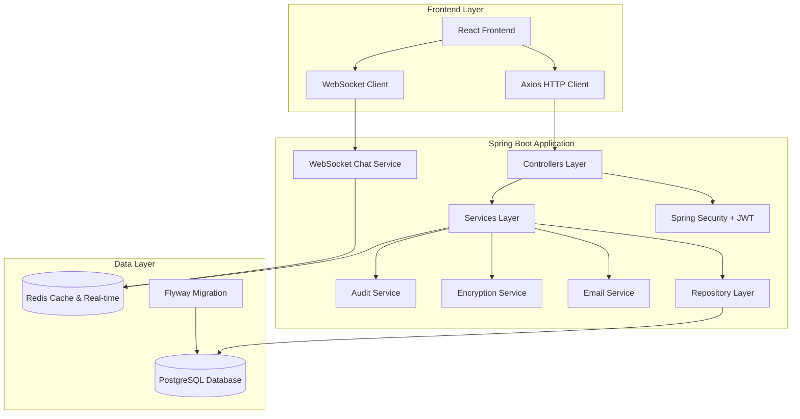

# Design Document - Employee Management System

## Overview

The Employee Management System is a comprehensive enterprise-grade HR management solution built with Spring Boot 3.5.3 and Java 24. The system provides role-based access control, employee information management, department processing, payroll management, and communication features. It follows a layered architecture pattern with clear separation of concerns and leverages Spring Boot's auto-configuration capabilities.

## Architecture

### System Architecture



### Hybrid Data Storage Strategy

The system uses a hybrid approach with PostgreSQL as the primary database and Redis for caching and real-time features:

**PostgreSQL (Primary Database):**
- All core business entities (User, Role, Resource, Employee, Department, Position, PayrollLedger)
- All transactional data with ACID compliance
- Relational integrity enforcement with foreign key constraints
- Complex queries, joins, and reporting capabilities
- Audit trails and historical data
- User authentication data and role assignments

**Redis (Cache & Real-time Only):**
- JWT token blacklisting for logout functionality
- Session data caching (not authentication state)
- Real-time chat messages and notifications
- Search result caching and frequently accessed data
- WebSocket connection management
- Department tree caching for performance

**Critical Design Principle:** Redis is used exclusively for caching and real-time features. All persistent, relational data must be stored in PostgreSQL to ensure data integrity, consistency, and proper transaction support.

### Technology Stack Integration

- **Backend**: Spring Boot 3.5.4 with Java 24
- **Security**: Spring Security with JWT authentication and role-based authorization
- **Primary Database**: PostgreSQL 15.x with JPA/Hibernate
- **Cache & Real-time**: Redis 7.x for caching and WebSocket features
- **Migration**: Flyway for database versioning and schema management
- **Email**: Spring Boot Mail with Freemarker templates
- **Encryption**: AES encryption for sensitive PII data
- **Build**: Maven with standard Spring Boot structure
- **Deployment**: Executable JAR with embedded Tomcat (modern approach)

## Components and Interfaces

### 1. Security and Permission Management

#### Permission Management Components
```java
// Core permission entities (PostgreSQL-based)
@Entity
@Table(name = "resources")
public class Resource {
    @Id
    @GeneratedValue(strategy = GenerationType.IDENTITY)
    private Long id;
    private String name;
    private String url;
    private String method;
    private String description;
    private String category; // Resource category for organization
    private Boolean active = true;
    
    @CreatedDate
    private Instant createdAt;
    @LastModifiedDate
    private Instant updatedAt;
    private Long createdBy;
    private Long updatedBy;
}

@Entity
@Table(name = "roles")
public class Role {
    @Id
    @GeneratedValue(strategy = GenerationType.IDENTITY)
    private Long id;
    private String name;
    private String description;
    private Boolean active = true;
    
    @CreatedDate
    private Instant createdAt;
    @LastModifiedDate
    private Instant updatedAt;
    private Long createdBy;
    private Long updatedBy;
    
    @ManyToMany
    @JoinTable(name = "role_resources")
    private Set<Resource> resources;
}

@Entity
@Table(name = "users")
public class User {
    @Id
    @GeneratedValue(strategy = GenerationType.IDENTITY)
    private Long id;
    private String username;
    private String password; // BCrypt encoded
    private String email;
    private Boolean enabled = true;
    private Integer loginAttempts = 0;
    private Boolean accountLocked = false;
    
    @CreatedDate
    private Instant createdAt;
    @LastModifiedDate
    private Instant updatedAt;
    private Long createdBy;
    private Long updatedBy;
    
    @ManyToMany
    @JoinTable(name = "user_roles")
    private Set<Role> roles;
}
```

#### Permission String Format
The system uses a standardized permission string format: `RESOURCE:ACTION`
- Examples: `EMPLOYEE:READ`, `EMPLOYEE:WRITE`, `DEPARTMENT:DELETE`, `PAYROLL:ADMIN`
- This format is used consistently across all authorization checks

#### Security Configuration
```java
@Configuration
@EnableWebSecurity
public class SecurityConfig {
    @Bean
    public SecurityFilterChain filterChain(HttpSecurity http);
    
    @Bean
    public PasswordEncoder passwordEncoder();
    
    @Bean
    public AuthenticationManager authenticationManager();
}
```

### 2. Department Management

#### Department Entity and Service
```java
@Entity
@Table(name = "departments")
public class Department {
    @Id
    @GeneratedValue(strategy = GenerationType.IDENTITY)
    private Long id;
    private String name;
    private String code; // Unique department code
    private String description;
    private String depPath; // Materialized path for hierarchy
    private Long parentId;
    private Boolean isParent = false;
    private Integer level = 0;
    private Boolean enabled = true;
    private Long managerId; // Employee ID of department manager
    
    @CreatedDate
    private Instant createdAt;
    @LastModifiedDate
    private Instant updatedAt;
    private Long createdBy;
    private Long updatedBy;
    
    @ManyToOne
    @JoinColumn(name = "parent_id", insertable = false, updatable = false)
    private Department parent;
    
    @OneToMany(mappedBy = "parent")
    private Set<Department> children;
}

@Service
public class DepartmentService {
    public List<Department> getDepartmentTree();
    public Department createDepartment(DepartmentCreateRequest request);
    public void updateDepartment(Long id, DepartmentUpdateRequest request);
    public void deleteDepartment(Long id); // With dependency validation
    public void moveDepartment(Long id, Long newParentId); // Atomic path updates
}
```

### 3. Employee Management

#### Employee Entity and Related Services
```java
@Entity
@Table(name = "employees")
public class Employee {
    @Id
    @GeneratedValue(strategy = GenerationType.IDENTITY)
    private Long id;
    private String employeeNumber; // Unique
    private String firstName;
    private String lastName;
    private String email; // Unique
    private String phone;
    private Long departmentId;
    private Long positionId;
    private Long managerId;
    private LocalDate hireDate;
    private LocalDate terminationDate;
    
    @Enumerated(EnumType.STRING)
    private EmployeeStatus status; // ACTIVE, INACTIVE, TERMINATED, ON_LEAVE
    
    @Enumerated(EnumType.STRING)
    private EmploymentType employmentType; // FULL_TIME, PART_TIME, CONTRACT
    
    @Enumerated(EnumType.STRING)
    private PayType payType; // SALARY, HOURLY
    
    private BigDecimal salary; // For salaried employees
    private BigDecimal hourlyRate; // For hourly employees
    
    // Encrypted sensitive fields
    private String dateOfBirth; // Encrypted
    private String bankAccount; // Encrypted
    private String taxId; // Encrypted
    
    @CreatedDate
    private Instant createdAt;
    @LastModifiedDate
    private Instant updatedAt;
    private Long createdBy;
    private Long updatedBy;
    
    @ManyToOne
    @JoinColumn(name = "department_id", insertable = false, updatable = false)
    private Department department;
    
    @ManyToOne
    @JoinColumn(name = "position_id", insertable = false, updatable = false)
    private Position position;
}

@Service
public class EmployeeService {
    public Page<Employee> getEmployees(Pageable pageable, EmployeeSearchCriteria criteria);
    public Employee createEmployee(EmployeeCreateRequest request);
    public void updateEmployee(Long id, EmployeeUpdateRequest request);
    public void deleteEmployees(List<Long> ids); // Batch operation with validation
    public EmployeeImportResult importFromExcel(MultipartFile file);
    public byte[] exportToExcel(EmployeeExportRequest request);
}
```

### 4. Position and Title Management

#### Position Management Components
```java
@Entity
@Table(name = "positions")
public class Position {
    @Id
    @GeneratedValue(strategy = GenerationType.IDENTITY)
    private Long id;
    private String jobTitle;
    private String professionalTitle;
    private String code; // Unique position code
    private String description;
    private Long departmentId;
    
    @Enumerated(EnumType.STRING)
    private PositionLevel level; // JUNIOR, SENIOR, MANAGER, DIRECTOR
    
    @Enumerated(EnumType.STRING)
    private PositionCategory category; // TECHNICAL, MANAGEMENT, ADMINISTRATIVE
    
    private BigDecimal minSalary; // Salary range validation
    private BigDecimal maxSalary;
    private Boolean enabled = true;
    
    @CreatedDate
    private Instant createdAt;
    @LastModifiedDate
    private Instant updatedAt;
    private Long createdBy;
    private Long updatedBy;
    
    @ManyToOne
    @JoinColumn(name = "department_id", insertable = false, updatable = false)
    private Department department;
}

@Service
public class PositionService {
    public Page<Position> getPositions(Pageable pageable, PositionSearchCriteria criteria);
    public Position createPosition(PositionCreateRequest request);
    public void updatePosition(Long id, PositionUpdateRequest request);
    public void deletePosition(Long id); // With dependency validation
    public void validateSalaryRange(BigDecimal salary, Long positionId); // Business rule validation
}
```

### 5. Communication System

#### Email Service
```java
@Service
public class EmailService {
    @Async
    public void sendTemplatedEmail(String to, String template, Map<String, Object> variables);
    
    @Async
    public void sendBulkEmails(List<String> recipients, String template, Map<String, Object> variables);
}
```

#### Chat and Notification System
```java
@Entity
public class MessageContent {
    private Long id;
    private String content;
    private LocalDateTime createdAt;
    private Long senderId;
    private MessageType type;
}

@Entity
public class SystemMessage {
    private Long id;
    private Long userId;
    private Long messageId;
    private Boolean isRead;
    private LocalDateTime readAt;
}

@Service
public class NotificationService {
    public void createNotification(Long userId, String content);
    public List<SystemMessage> getUserNotifications(Long userId);
    public void markAsRead(Long messageId, Long userId);
}
```

### 6. Payroll Management

#### Payroll Components
```java
@Entity
@Table(name = "payroll_ledgers")
public class PayrollLedger {
    @Id
    @GeneratedValue(strategy = GenerationType.IDENTITY)
    private Long id;
    private Long employeeId;
    private String employeeNumber; // Snapshot for historical accuracy
    
    // Employee details at time of payroll (for historical accuracy)
    private String employeeFirstName;
    private String employeeLastName;
    private String departmentName;
    private String positionTitle;
    
    @Enumerated(EnumType.STRING)
    private PayType payType; // SALARY, HOURLY
    
    private BigDecimal baseSalary;
    private BigDecimal hourlyRate;
    private Integer hoursWorked; // For hourly employees
    private BigDecimal overtimeHours;
    private BigDecimal overtimeRate;
    private BigDecimal allowances;
    private BigDecimal deductions;
    private BigDecimal grossPay;
    private BigDecimal netSalary;
    
    private LocalDate payPeriodStart;
    private LocalDate payPeriodEnd;
    
    @Enumerated(EnumType.STRING)
    private PayrollStatus status; // DRAFT, APPROVED, PAID, CANCELLED
    
    @CreatedDate
    private Instant createdAt;
    @LastModifiedDate
    private Instant updatedAt;
    private Long createdBy;
    private Long updatedBy;
    private Long approvedBy;
    private Instant approvedAt;
    
    @ManyToOne
    @JoinColumn(name = "employee_id", insertable = false, updatable = false)
    private Employee employee;
}

@Service
public class PayrollService {
    public PayrollLedger createPayrollLedger(PayrollCreateRequest request);
    public PayrollLedger getPayrollLedger(Long id);
    public void updatePayrollLedger(Long id, PayrollUpdateRequest request);
    public Page<PayrollLedger> getEmployeePayrollHistory(Long employeeId, Pageable pageable);
    public void approvePayroll(Long id, Long approverId);
    public PayrollCalculationResult calculatePayroll(Long employeeId, LocalDate periodStart, LocalDate periodEnd);
}
```

## Data Models

### Database Schema Design

#### PostgreSQL Core Tables Structure
```sql
-- User Management (PostgreSQL)
users (id, username, password, email, enabled, login_attempts, account_locked, created_at, updated_at, created_by, updated_by)
roles (id, name, description, active, created_at, updated_at, created_by, updated_by)
resources (id, name, url, method, description, category, active, created_at, updated_at, created_by, updated_by)
user_roles (user_id, role_id)
role_resources (role_id, resource_id)

-- Organization Structure (PostgreSQL)
departments (id, name, code, description, dep_path, parent_id, is_parent, level, enabled, manager_id, created_at, updated_at, created_by, updated_by)
positions (id, job_title, professional_title, code, description, department_id, level, category, min_salary, max_salary, enabled, created_at, updated_at, created_by, updated_by)

-- Employee Management (PostgreSQL)
employees (id, employee_number, first_name, last_name, email, phone, department_id, position_id, manager_id, hire_date, termination_date, status, employment_type, pay_type, salary, hourly_rate, date_of_birth_encrypted, bank_account_encrypted, tax_id_encrypted, created_at, updated_at, created_by, updated_by)

-- Communication (PostgreSQL for persistence, Redis for real-time)
email_templates (id, name, code, subject, content, template_type, category, active, variables, created_at, updated_at, created_by, updated_by)
email_logs (id, template_code, to_email, cc_emails, bcc_emails, subject, content, status, sent_at, error_message, retry_count, sent_by, created_at, updated_at)
notifications (id, user_id, title, content, type, priority, is_read, read_at, created_at, updated_at)

-- Payroll (PostgreSQL)
payroll_ledgers (id, employee_id, employee_number, employee_first_name, employee_last_name, department_name, position_title, pay_type, base_salary, hourly_rate, hours_worked, overtime_hours, overtime_rate, allowances, deductions, gross_pay, net_salary, pay_period_start, pay_period_end, status, created_at, updated_at, created_by, updated_by, approved_by, approved_at)

-- Audit Trail (PostgreSQL)
audit_logs (id, table_name, record_id, action, old_values, new_values, user_id, created_at)
```

### Redis Data Structure (Caching Only)

#### Caching Strategy
```java
// JWT token blacklisting (for logout)
"jwt:blacklist:{tokenId}" -> expiration timestamp

// Permission caching
"user:permissions:{userId}" -> Set<String> permissions (TTL: 30 minutes)

// Department tree caching
"department:tree" -> Department tree structure (TTL: 1 hour)

// Employee search cache
"employee:search:{hash}" -> Page<Employee> results (TTL: 15 minutes)

// Real-time chat messages (temporary storage)
"chat:room:{roomId}:messages" -> List<ChatMessage> (TTL: 24 hours)

// WebSocket session management
"websocket:sessions:{userId}" -> Set<String> sessionIds

// Notification queue
"notifications:user:{userId}" -> List<Notification> (TTL: 7 days)
```

**Important:** Redis is used exclusively for caching and real-time features. All persistent data is stored in PostgreSQL.

## Error Handling

### Unified Exception Handling

#### Global Exception Handler
```java
@ControllerAdvice
public class GlobalExceptionHandler {
    @ExceptionHandler(ValidationException.class)
    public ResponseEntity<ErrorResponse> handleValidation(ValidationException ex);
    
    @ExceptionHandler(AccessDeniedException.class)
    public ResponseEntity<ErrorResponse> handleAccessDenied(AccessDeniedException ex);
    
    @ExceptionHandler(DataIntegrityViolationException.class)
    public ResponseEntity<ErrorResponse> handleDataIntegrity(DataIntegrityViolationException ex);
    
    @ExceptionHandler(Exception.class)
    public ResponseEntity<ErrorResponse> handleGeneral(Exception ex);
}
```

#### Custom Exception Types
```java
public class EmployeeNotFoundException extends RuntimeException;
public class DepartmentHierarchyException extends RuntimeException;
public class PayrollCalculationException extends RuntimeException;
public class EmailSendingException extends RuntimeException;
public class ImportValidationException extends RuntimeException;
```

### Frontend Error Handling

#### Axios Interceptor Configuration
```javascript
// Request interceptor for authentication
axios.interceptors.request.use(config => {
    const token = localStorage.getItem('token');
    if (token) {
        config.headers.Authorization = `Bearer ${token}`;
    }
    return config;
});

// Response interceptor for error handling
axios.interceptors.response.use(
    response => response,
    error => {
        if (error.response.status === 401) {
            // Handle authentication errors
        } else if (error.response.status === 403) {
            // Handle authorization errors
        }
        return Promise.reject(error);
    }
);
```

## Testing Strategy

### Unit Testing Approach

#### Service Layer Testing
```java
@ExtendWith(MockitoExtension.class)
class EmployeeServiceTest {
    @Mock
    private EmployeeRepository employeeRepository;
    
    @InjectMocks
    private EmployeeService employeeService;
    
    @Test
    void shouldCreateEmployeeSuccessfully();
    
    @Test
    void shouldThrowExceptionWhenEmployeeNumberExists();
}
```

#### Repository Testing
```java
@DataRedisTest
class EmployeeRepositoryTest {
    @Autowired
    private TestEntityManager entityManager;
    
    @Autowired
    private EmployeeRepository employeeRepository;
    
    @Test
    void shouldFindEmployeesByDepartment();
    
    @Test
    void shouldSupportPaginationAndSorting();
}
```

### Integration Testing

#### Web Layer Testing
```java
@SpringBootTest
@AutoConfigureTestDatabase
class EmployeeControllerIntegrationTest {
    @Autowired
    private MockMvc mockMvc;
    
    @Test
    @WithMockUser(roles = "HR_MANAGER")
    void shouldCreateEmployeeWithValidData();
    
    @Test
    @WithMockUser(roles = "EMPLOYEE")
    void shouldDenyAccessToRestrictedEndpoints();
}
```

### Security Testing

#### Authentication and Authorization Tests
```java
@SpringBootTest
@AutoConfigureTestDatabase
class SecurityIntegrationTest {
    @Test
    void shouldAuthenticateValidUser();
    
    @Test
    void shouldDenyAccessWithoutPermission();
    
    @Test
    void shouldLoadUserPermissionsDynamically();
}
```

### Performance Testing

#### Load Testing Strategy
- Use JMeter for API endpoint load testing
- Test concurrent user scenarios for chat functionality
- Validate database performance with large datasets
- Monitor Redis cache hit rates and performance

### Email and Notification Testing

#### Async Service Testing
```java
@SpringBootTest
class EmailServiceTest {
    @MockBean
    private JavaMailSender mailSender;
    
    @Test
    void shouldSendTemplatedEmailAsynchronously();
    
    @Test
    void shouldHandleEmailSendingFailures();
}
```

## API Design Patterns

### DTO Design Strategy

#### Request/Response DTO Separation
```java
// Separate DTOs for different operations
public class EmployeeDto {
    private Long id;
    private String employeeNumber;
    private String firstName;
    private String lastName;
    private String email;
    private DepartmentDto department;
    private PositionDto position;
    private Instant createdAt;
    private Instant updatedAt;
    // Read-only fields included
}

public class EmployeeCreateRequest {
    @NotBlank
    private String firstName;
    @NotBlank
    private String lastName;
    @Email
    private String email;
    private Long departmentId;
    private Long positionId;
    // No id, createdAt, updatedAt fields
}

public class EmployeeUpdateRequest {
    @NotBlank
    private String firstName;
    @NotBlank
    private String lastName;
    @Email
    private String email;
    private Long departmentId;
    private Long positionId;
    // No id, createdAt, updatedAt fields
}
```

#### Hierarchical Data DTOs
```java
// Safe hierarchical DTOs without circular references
public class DepartmentTreeDto {
    private Long id;
    private String name;
    private String code;
    private List<DepartmentTreeDto> children; // Only children, no parent reference
}

public class DepartmentDto {
    private Long id;
    private String name;
    private String code;
    private Long parentId; // Reference by ID only
    private String parentName; // Denormalized for display
}
```

#### Batch Operation DTOs
```java
public class BatchDeleteRequest {
    @NotEmpty
    private List<Long> ids;
    private String reason; // Audit trail
}

public class BatchOperationResult {
    private int totalRequested;
    private int successful;
    private int failed;
    private List<BatchError> errors;
}
```

## Implementation Considerations

### Security Implementation
- Use Spring Security's method-level security with @PreAuthorize("hasPermission(#id, 'EMPLOYEE', 'READ')")
- Implement stateless JWT authentication (no Redis sessions for auth state)
- Use JWT token blacklisting in Redis for logout functionality
- Use BCrypt for password hashing with proper salt rounds
- Implement field-level encryption for sensitive PII data

### Data Integrity and Validation
- Use PostgreSQL foreign key constraints for referential integrity
- Implement business rule validation in service layer
- Use Instant timestamps for all temporal data (time-zone aware)
- Implement comprehensive audit trails for all critical entities
- Use enum types instead of string fields for fixed value sets

### Performance Optimization
- Implement Redis caching for frequently accessed data (department trees, user permissions)
- Use PostgreSQL connection pooling with HikariCP
- Implement proper database indexing for query performance
- Use async processing for email sending and heavy operations
- Implement pagination for all list endpoints

### API Design Best Practices
- Use dedicated CreateRequest and UpdateRequest DTOs
- Implement proper batch operation endpoints
- Avoid circular references in hierarchical DTOs
- Use consistent error response formats
- Implement proper HTTP status codes and error messages

### Scalability Considerations
- Design stateless services for horizontal scaling
- Use Redis for distributed caching only (not primary data)
- Implement proper database indexing and query optimization
- Use connection pooling for database access
- Implement async processing for non-critical operations

### Monitoring and Logging
- Use Spring Boot Actuator for health checks and metrics
- Implement structured logging with correlation IDs
- Monitor PostgreSQL and Redis performance separately
- Track business metrics (login attempts, payroll processing, etc.)
- Implement comprehensive error tracking and alerting